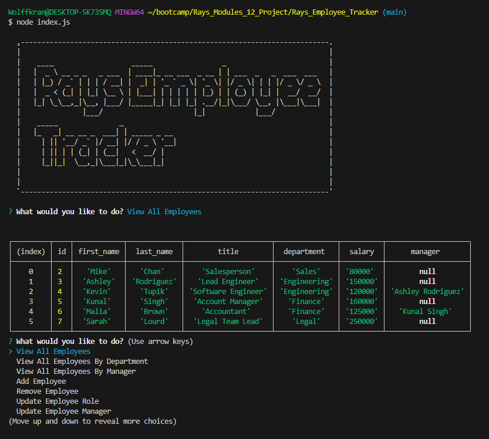

# 12 SQL: Employee Tracker

## User Story

AS A company proprietor,
I DESIRE the capability to oversee and administer the various departments, roles, and employees within my organization,
SO THAT I can efficiently structure and strategize for the success of my business.

## Description

- The motivation behind this project was to create a comprehensive command-line application that allows business owners or managers to efficiently manage their company's departments, roles, and employees. This tool aims to provide a user-friendly interface for organizing and planning business operations.
Why did you build this project?

- This project was built to address the need for a streamlined and centralized system for managing organizational structure. By developing a command-line application, users can perform essential tasks such as viewing, adding, updating, and removing departments, roles, and employees, thereby enhancing business efficiency.
What problem does it solve?

- The project solves the challenge of manual and time-consuming organization management by providing a digital solution for businesses. It offers a quick and effective way to organize departments, roles, and employees, facilitating better planning, coordination, and strategic decision-making.
What did you learn?

- During the development of this project, I gained practical experience in creating a command-line interface application and integrating it with a database. I learned about structuring and organizing database queries, handling user input, and implementing features that align with real-world business needs. Additionally, the project enhanced my understanding of how businesses can leverage technology for operational efficiency and organization management.

## Installation

Prerequisites:

1. Node.js (version X.X.X or higher)
npm (included with Node.js installation)

2. Clone the Repository: ```https://github.com/Wolffkran/Rays_Employee_Tracker.git``

3. Navigate to the Project Directory: cd your-project

4. Install Dependencies: ```npm install```

5. Set Up Database:
Create a new MySQL database.
Update the db/connection.js file with your database connection details.

6. Run ```mdnode index.js``` to run the database in your terminal




## Review

You are required to submit BOTH of the following for review:

* A walkthrough video demonstrating the functionality of the application.

* The URL of the GitHub repository, with a unique name and a README describing the project.

- - -
© 2023 edX Boot Camps LLC. Confidential and Proprietary. All Rights Reserved.
